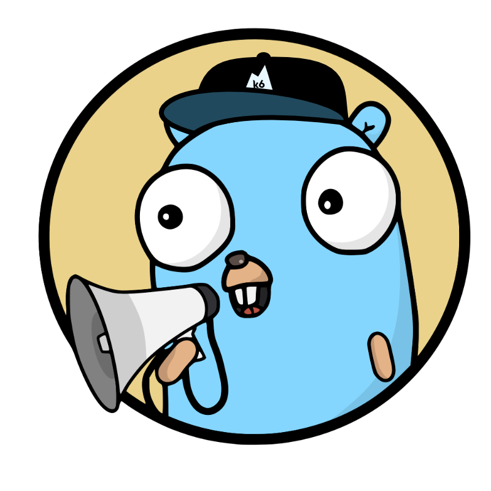

<div align="center">



## xk6-notification

This is a [k6](https://go.k6.io/k6) extension using the [xk6](https://github.com/k6io/xk6) system.

</div>

<br/>

> #### :exclamation: This is a proof of concept
>
> As such, it isn't supported by the k6 team, and may break in the future. USE AT YOUR OWN RISK!

## Build

To build a `k6` binary with this extension, first ensure you have the prerequisites:

- [Go toolchain](https://go101.org/article/go-toolchain.html)
- Git

Then:

1. Install `xk6`:
  ```shell
  $ go install github.com/k6io/xk6/cmd/xk6@latest
  ```

2. Build the binary:
  ```shell
  $ xk6 build --with github.com/dgzlopes/xk6-notification@latest
  ```

## Usage

```javascript
import http from 'k6/http';
import notification from 'k6/x/notification';

const url = 'slack://token-a/token-b/token-c';

export function setup() {
  notification.send(url, 'Starting test');
}

export default function () {
  http.get('http://test.k6.io');
}

export function teardown(data) {
  notification.send(url, 'Finishing test');
}
```

## Documentation

For a full documentation of the api and how to use it, see the [official shoutrrr documentation](https://containrrr.dev/shoutrrr).
